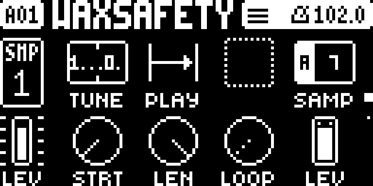

# Digitakt II firmware research

An emulator for the Elektron Digitakt II's control processor, plus tooling for
understanding and (eventually) patching its OS images.

**No Elektron firmware is included in this repository and none ever should
be** — it is copyright Elektron. You supply your own lawfully-obtained `.syx`;
`.gitignore` keeps it, the extracted sections and the snapshots out of git.

**Only `Digitakt_II_OS1.15C.syx` has been tested**, SHA-256
`62d588456e47194bd56dfee9568fb9dd4521c4ff1e8b5427eb461355532e8c6c`. Every
address in this repo and its documentation is specific to that build. A
different firmware version will almost certainly not boot, and nothing here
tries to detect that for you.

## What it does

It boots. The main OS runs, spawns its RTOS tasks, reaches its message loop and
**renders its user interface** — pattern and project name, tempo, the encoder
parameter row, the sample page with its knob widgets.



It is a research instrument, not a Digitakt you can play. It runs at roughly
2M instructions/second against the real part's ~264M, so a nominal 30 Hz UI
draws at well under one frame per second. See **Limitations** below for what
that rules out.

## Quick start

You need Python 3.12 (via [uv](https://docs.astral.sh/uv/)) and your own
firmware file in the working directory.

```sh
uv sync
uv run python -m emu.run Digitakt_II_OS1.15C.syx --weakptr
```

That checks each prerequisite, builds the boot snapshots on first run (one cold
boot from reset, a few minutes — it happens once), and opens the live panel.

**One step is not automated.** The sections inside the `.syx` are compressed,
and this repo cannot decompress them yet, so extract them once with
[mischa85/elektron-firmware-tool](https://github.com/mischa85/elektron-firmware-tool)
(MIT, supports device `0x14` = Digitakt II):

```sh
elektron-firmware-tool -i Digitakt_II_OS1.15C.syx -o sections/
```

`emu.run` will tell you this if the sections are missing. Why it is not
automated: the only implementation of the decompressor known to be correct is
the device's own, at `0x80000432`, which `emu/oracle.py` can run — but it lives
inside section 2, which is itself compressed, so it cannot bootstrap itself.
The stream is *not* stock aPLib (a stock depacker takes the first data byte as
a literal; here that byte is a tag byte with `1` meaning literal). Closing this
means writing a depacker against that observation and checking it byte-for-byte
against `emu.oracle.depack`.

### Options

```sh
uv run python -m emu.run [firmware.syx] [snapshot] [options]
```

| | |
|---|---|
| `--weakptr` | Step over two branches in `weak_ptr::lock` that otherwise freeze the main task after 153 messages. They contradict the memory they branch on — an emulator defect, not a firmware decision. Recommended. |
| `--slc` | Force the eMMC "SLC mode" flag. Unnecessary now that the eSDHC model supplies it. |
| `--scale N` | Integer panel zoom. Defaults to whatever fits your screen. |

## What works, and what does not

**Working:** the ColdFire core, the interrupt controllers, the PIT and DMA
timers, eDMA, the front-panel link, the coprocessor port's handshake, the
display, and the SD/MMC controller through card identification.

**Storage is not supported yet.** The eSDHC controller and an eMMC are modelled
far enough to complete card identification and read EXT_CSD, but **no block
data is served** — `CMD18` reads return zeros. Bulk transfers move through the
SoC's eDMA with `SADDR = DATPORT`, and nothing backs them. So the firmware
boots and draws, but cannot load a project or samples, and anything that
touches the filesystem will not work. Backing it with a real image, and then
generating one from a folder of samples, is the next substantial piece of work.

**No audio.** The device makes sound on a second processor — an Analog Devices
ADSP-21569 SHARC+ running its own firmware. Nothing here emulates it. The main
OS holds parameter state and RPCs it to the SHARC; that split is what makes
audio a separate project rather than a missing feature.

**No input.** The front-panel protocol is decoded in the transmit direction
only. Buttons and encoders arrive on the receive side, which is not modelled,
so the UI cannot be driven.

## The hardware

Not ARM. Two processors:

| | Part | Notes |
|---|---|---|
| Control | Freescale **ColdFire MCF54415** | 68k-family ISA, **big-endian**. UI, sequencer, files, MIDI. C++. |
| Audio | Analog Devices **ADSP-21569** SHARC+ | FreeRTOS. Shipped as ADI loader records. |

## Layout

```
dt2/container.py   .syx -> 8-in-7 decode -> ELE3 container + section table
dt2/coldfire.py    ColdFire-aware disassembly (Capstone misses MVS/MVZ and FF1)
emu/harness.py     Unicorn m68k machine; works around four Unicorn/ColdFire gaps
emu/longrun.py     build() -- the machine, its models and every opt-in switch
emu/run.py         .syx -> running emulator, one command
emu/gui.py         live panel
emu/panel.py       the framebuffer the firmware actually draws into
emu/esdhc.py       SD/MMC controller + eMMC (identification only)
emu/oracle.py      runs the DEVICE'S OWN validators against a candidate image
docs/HANDOVER.md   current state, what to do next, and the traps that cost time
```

## Other tools

```sh
uv run python -m dt2.container Digitakt_II_OS1.15C.syx   # section table
uv run python -m emu.panel <snap> <instrs> 3 out.png     # render the panel
uv run python -m emu.uiprobe sweep                       # the measurement sweep
uv run python -m emu.tasks <snap>                        # parked PC per task
uv run python emu/oracle.py                              # acceptance oracle
```

## Continuing this work

**Read [`docs/HANDOVER.md`](docs/HANDOVER.md) first.** It is written for someone
with no memory of the sessions that produced this, and it opens with six
standing warnings about measurements that have already misled people — several
of them cost a whole session each. [`docs/NEXT.md`](docs/NEXT.md) is the
overview and [`docs/FINDINGS.md`](docs/FINDINGS.md) the older evidence.

## The acceptance oracle

The bootstrap decides whether to accept an OS image using a few self-contained
routines. Emulating them turns "will the device take this?" from a hardware
experiment into a unit test. Two are implemented and verified byte-exact:

- **CRC-32** `0x80001bd0` — poly `0xEDB88320`, residue `0xDEBB20E3`
- **Depacker** `0x80000432` — decompresses a rebuilt image *using the device's
  own code*, confirming a repacked stream is acceptable without hardware

Still to add: the content checksum at `0x40003ca6` and the HMAC-SHA256 trailer
check at `0x80005e2a`. Together those are the bootstrap's entire accept/reject
decision.

## Safety

Established by static analysis and emulation, not by flashing anything:

- The **recovery path** is the bootstrap's STARTUP menu (hold FUNC at
  power-on), independent of MAIN OS, accepting SysEx over **MIDI DIN only** —
  not USB.
- The only irreversible operation is **BOOTSTRAP UPGRADE**, gated at
  `0x80001c72` by `bcc` — it runs only when the incoming bootstrap version is
  *strictly greater* than the running one (`0x0200` in 1.15C). Patching
  sections 3/7 never presents a higher version, so that step is unreachable.
- **Never modify sections 2 (bootstrap) or 4 (updater).** A patcher should
  hard-fail on any patch targeting them.

Read `docs/FINDINGS.md` before flashing anything.

## Licence and attribution

Original work here is MIT. Not affiliated with or endorsed by Elektron.
Container format knowledge derives from `mischa85/elektron-firmware-tool` (MIT);
architecture and memory-map facts marked *Documented* in FINDINGS.md derive from
`lalzart/digitakt-ii-firmware-research-public`.
